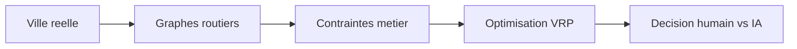
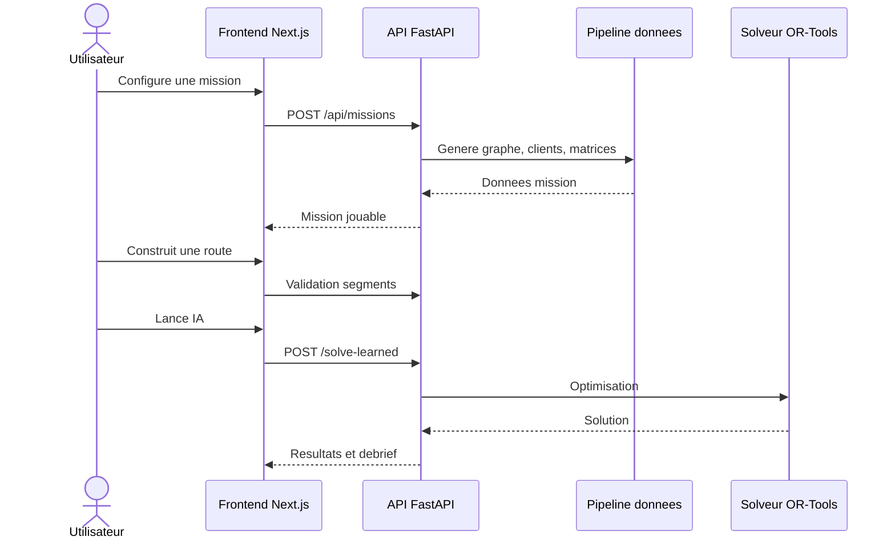
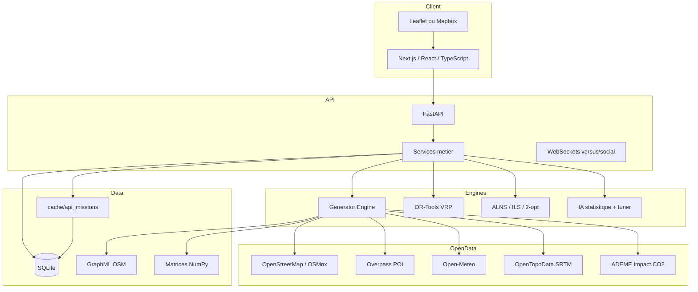
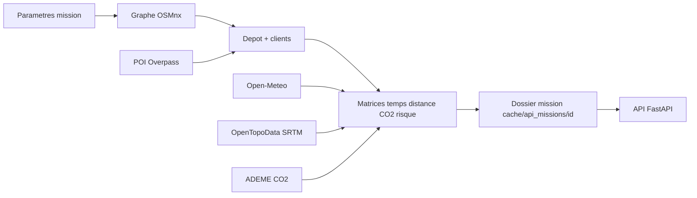
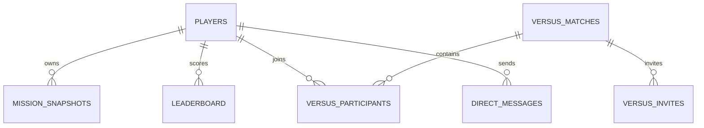

# Dossier complet pour soutenance technique 20 minutes

Projet : **Operation Noel / Santa Router Optimizer**  
Sujet : graphes, open data, plus courts chemins, optimisation, intelligence artificielle, architecture de donnees, conception web  
Public cible : jury universitaire/professionnel  
Objectif du document : fournir a Gemini une base complete pour generer les slides sans acces au repository.

---

## 0. Consignes importantes pour Gemini

Ce document est la source de reference. Ne pas inventer de details absents. Ne pas pretendre avoir acces au code.

Points de vigilance :

- Le projet utilise une IA au sens **systeme d'aide a la decision** : profils heuristiques, apprentissage statistique sur historiques, tuner OR-Tools et exploration de portefeuilles. Ce n'est pas un reseau de neurones.
- La meteo courante est issue de **Open-Meteo**, pas OpenWeatherMap. Certains textes anciens du frontend peuvent encore mentionner OpenWeatherMap : ne pas les reprendre en soutenance.
- OSRM existe comme script historique/optionnel, mais le pipeline principal actuel calcule les matrices via **OSMnx + NetworkX/Dijkstra** sur un graphe routier local.
- Les donnees open data principales sont OpenStreetMap/Overpass, Open-Meteo, OpenTopoData SRTM et ADEME Impact CO2.
- Les chiffres de performances issus des rapports sont des preuves de benchmark locales. Les presenter comme resultats experimentaux du projet, pas comme garanties universelles.

---

## 1. Pitch executif

Operation Noel est une application web de planification de tournees de livraison dans une ville. Elle transforme des donnees ouvertes geographiques, meteorologiques et environnementales en un probleme de graphe et d'optimisation : trouver des itineraires efficaces pour livrer des clients sous contraintes de temps, capacite, meteo, incidents, emission CO2 et qualite de service.

Le projet combine :

- un frontend Next.js pour creer une mission, visualiser une carte, construire une route humaine et comparer avec une IA ;
- un backend FastAPI qui expose les missions, solveurs, algorithmes de graphe, authentification, classement et modes versus ;
- un pipeline de donnees qui construit des graphes routiers OSM, genere des clients, calcule des matrices multi-objectifs et stocke les missions ;
- un solveur d'optimisation base sur OR-Tools, enrichi par ALNS, ILS, 2-opt, 3-opt, Or-opt et 2-opt* ;
- des modules pedagogiques pour montrer Dijkstra, A*, Floyd-Warshall, VRP et metriques de graphes ;
- une couche IA qui recommande des profils et parametres a partir des historiques.

Phrase d'accroche possible :

> Le projet prend une ville reelle, la transforme en graphe exploitable, puis compare la strategie humaine et la strategie algorithmique pour resoudre un probleme de tournee sous contraintes.

---

## 2. Plan recommande de la soutenance

Timing cible : 20 minutes, environ 20 slides.

1. Titre et accroche - 30 s
2. Contexte et problematique - 1 min
3. Objectifs metier et cas d'usage - 1 min
4. Demo fonctionnelle rapide - 1 min
5. Architecture globale - 1 min 30
6. Pipeline open data - 1 min 30
7. Modele de donnees et stockage - 1 min
8. Construction du graphe routier - 1 min 30
9. Plus courts chemins : Dijkstra et A* - 1 min 30
10. Matrices multi-objectifs - 1 min
11. Formulation VRP / VRPTW - 1 min 30
12. Solveur OR-Tools - 1 min 30
13. Optimisations post-solve - 1 min 30
14. Incidents et replanification - 1 min
15. Intelligence artificielle - 2 min
16. Frontend et UX - 1 min
17. Performances, tests, reproductibilite - 1 min 30
18. Securite et qualite - 45 s
19. Limites et ameliorations - 1 min
20. Conclusion + transition FAQ - 30 s

---

## 3. Slides detaillees

### Slide 1 - Titre

Titre affiche :

**Operation Noel : optimisation de tournees sur graphes ouverts**

Sous-titre :

Graphes routiers, open data, VRP, IA decisionnelle et application web interactive.

Texte court :

- Donnees reelles de ville
- Itineraires sous contraintes
- Comparaison humain vs IA
- Visualisation web et debrief algorithmique

Notes orales :

Presenter le projet comme une chaine complete : donnees ouvertes -> graphe -> matrices -> solveur -> interface utilisateur -> analyse des resultats.

Visuel recommande :

- Capture pleine page de la carte de mission avec parcours trace.
- Ajouter en overlay trois mots-cles : `Open Data`, `Graphes`, `Optimisation`.

Preuves projet :

- `README.md`
- `frontend/app/page.tsx`
- `backend/app/main.py`

---

### Slide 2 - Contexte et problematique

Titre affiche :

**Planifier une tournee urbaine n'est pas juste trouver une route**

Texte affiche :

- Les rues forment un graphe dirige et pondere.
- Les clients ont des positions, demandes, fenetres horaires et contraintes.
- La meteo, le trafic, les incidents et le mode de transport modifient les couts.
- L'objectif devient multi-critere : temps, distance, CO2, risque, couverture.

Notes orales :

Le probleme ressemble au cas classique du livreur, mais le projet le rend plus realiste : capacite de traineau/vehicule, horaires, meteo, incidents, emissions et possibilite de ne pas servir certains points avec penalite.

Diagramme a generer :



Preuves projet :

- `scripts/generator_engine.py`
- `final_scripts/solve_santa_final.py`
- `backend/app/services.py`

---

### Slide 3 - Objectifs metier

Titre affiche :

**Objectif : livrer mieux sous contraintes**

Texte affiche :

- Creer une mission de livraison dans une zone reelle.
- Construire ou choisir des routes sur carte.
- Evaluer les choix humains en temps reel.
- Lancer un solveur IA/optimisation.
- Comparer les performances et produire un debrief.

Notes orales :

Le projet n'est pas seulement un solveur en ligne de commande. Il expose l'optimisation dans une experience utilisateur : creation, decision, comparaison, score, classement et mode competitif.

Captures a faire :

- Page `/salon` avec creation de mission.
- Page `/mission/{id}` avec carte et sidebar.
- Page `/mission/{id}/debrief` avec score.

Preuves projet :

- `frontend/components/mission-creator.tsx`
- `frontend/components/mission-workspace.tsx`
- `frontend/components/debrief-view.tsx`

---

### Slide 4 - Parcours utilisateur

Titre affiche :

**Parcours fonctionnel du site**

Texte affiche :

1. Choisir une ville, un rayon, un nombre de clients et des contraintes.
2. Generer une mission a partir de donnees reelles.
3. Composer une route humaine avec suggestions et faisabilite.
4. Lancer le solveur IA.
5. Comparer les resultats : temps, distance, CO2, score, clients livres.

Notes orales :

Insister sur la logique pedagogique : l'utilisateur voit les effets de ses choix, puis les compare a des algorithmes. Le site sert donc a la fois de simulateur, de demonstrateur algorithmique et d'outil d'analyse.

Diagramme a generer :



Preuves projet :

- `frontend/lib/api.ts`
- `backend/app/main.py`
- `backend/app/services.py`

---

### Slide 5 - Architecture globale

Titre affiche :

**Architecture technique**

Texte affiche :

- Frontend : Next.js 14, React, TypeScript, React Query, Leaflet/Mapbox.
- Backend : FastAPI, Pydantic, services metier, WebSockets.
- Donnees : cache fichiers, matrices NumPy, graphes GraphML, SQLite.
- Optimisation : OR-Tools + heuristiques locales.
- Open data : OSM, Overpass, Open-Meteo, OpenTopoData, ADEME.

Notes orales :

Le backend joue le role d'orchestrateur. Il ne stocke pas seulement des routes : il gere la generation des missions, la validation des segments, les solveurs, l'apprentissage, les classements et les modes multi-joueurs.

Diagramme a generer :



Preuves projet :

- `frontend/package.json`
- `requirements.txt`
- `backend/app/main.py`
- `docker-compose.yml`

---

### Slide 6 - API et services backend

Titre affiche :

**Une API orientee mission**

Texte affiche :

- Creation et recuperation de missions.
- Validation de segments et options de route.
- Solveur classique et solveur appris.
- Algorithmes pedagogiques : Dijkstra, A*, Floyd-Warshall.
- Authentification, leaderboard, versus et WebSockets.

Notes orales :

Les endpoints montrent que le projet depasse le simple calcul de chemin. L'API expose une plateforme complete : jeu, analyse, apprentissage, comparaison et cooperation/competition.

Endpoints importants :

- `POST /api/missions`
- `GET /api/missions/{id}`
- `GET /api/missions/{id}/route-options`
- `POST /api/missions/{id}/validate-segment`
- `POST /api/missions/{id}/solve`
- `POST /api/missions/{id}/solve-learned`
- `GET /api/missions/{id}/dijkstra`
- `GET /api/missions/{id}/bidirectional-astar`
- `GET /api/missions/{id}/debrief`
- `GET /ws/versus/{match_id}`

Preuves projet :

- `backend/app/main.py`, lignes principales : routes missions, solveur, IA, graphes, leaderboard, WebSockets.
- `backend/app/schemas.py`
- `backend/app/services.py`

---

### Slide 7 - Pipeline open data

Titre affiche :

**De la ville reelle aux matrices exploitables**

Texte affiche :

- OSMnx telecharge le graphe routier.
- Overpass enrichit les points avec des noms de lieux reels.
- Open-Meteo ajoute un facteur meteo.
- OpenTopoData ajoute l'elevation si demandee.
- ADEME fournit un facteur CO2 si disponible.
- Les donnees sont normalisees puis stockees par mission.

Notes orales :

La valeur du pipeline vient de sa reproductibilite : chaque mission possede son dossier avec CSV, graphe, matrices, meteo, incidents et resultats. Cela permet d'auditer une mission apres coup.

Diagramme a generer :



Preuves projet :

- `scripts/generator_engine.py`
- `scripts/weather_engine.py`
- `scripts/elevation_engine.py`
- `scripts/mission_paths.py`

---

### Slide 8 - Structure des fichiers de mission

Titre affiche :

**Une mission est un paquet de donnees versionnable**

Texte affiche :

Chaque mission contient typiquement :

- `core_data/livraisons_5eme.csv` : depot + clients.
- `paris5.graphml` : graphe routier OSM.
- `live_time_matrix.npy` : matrice de temps.
- `matrix_5eme.npy` : matrice de distance.
- `co2_matrix.npy`, `risk_matrix.npy`, `composite_matrix.npy`.
- `weather_status.json`, `incidents.json`, `elevation.json`.
- `production_output/resultats_finaux.json`.

Notes orales :

Les matrices NumPy evitent de recalculer les plus courts chemins a chaque interaction. Le CSV reste lisible humainement et sert de point d'entree pour les clients, les poids, les fenetres horaires et les categories.

Preuves projet :

- `scripts/mission_paths.py`
- `scripts/generator_engine.py`
- `final_scripts/solve_santa_final.py`

---

### Slide 9 - Modele de donnees et persistance

Titre affiche :

**SQLite pour l'etat applicatif, fichiers pour le calcul lourd**

Texte affiche :

- SQLite stocke joueurs, missions, snapshots, leaderboard, versus, messages.
- Les fichiers stockent les graphes, matrices et resultats volumineux.
- Separation claire : etat applicatif vs artefacts calculatoires.

Notes orales :

Le choix est pragmatique : SQLite simplifie le deploiement local et Docker, tandis que les matrices et GraphML restent dans le filesystem pour etre relus efficacement par les moteurs de calcul.

Schema a generer :



Preuves projet :

- `backend/app/repository.py`
- Base SQLite : `cache/api_missions/operation_noel.db`
- Tables creees : players, password_reset_tokens, mission_snapshots, leaderboard, versus_matches, versus_participants, versus_invites, versus_queue, versus_leaderboard, friendships, direct_messages, user_blocks.

---

### Slide 10 - Construction du graphe

Titre affiche :

**La ville devient un MultiDiGraph**

Texte affiche :

- Noeuds : intersections ou points routiers OSM, avec latitude/longitude.
- Aretes : segments de route diriges.
- Poids : longueur, temps, CO2, risque, mode de transport.
- Le graphe est filtre autour d'une ville ou d'un point central.
- Les plus courts chemins alimentent les matrices entre depot et clients.

Notes orales :

Le graphe complet de la ville n'est pas le VRP directement. Le solveur travaille sur un graphe reduit compose du depot et des clients, dont les couts d'arc proviennent des plus courts chemins calcules dans le graphe routier complet.

Forme memoire :

- Graphe routier : `networkx.MultiDiGraph`.
- Matrices mission : tableaux `n x n` en NumPy.
- Routes cartographiques : geometries extraites des chemins OSM.

Preuves projet :

- `scripts/generator_engine.py`
- `scripts/routing_payloads.py`
- `core_data/graph_analysis_soutenance.json`

Chiffres a citer :

- Exemple de graphe d'analyse : 124 noeuds, 210 aretes.
- Degre moyen : environ 3,39.
- Diametre : 35.
- Densite : environ 0,0138.

---

### Slide 11 - Dijkstra

Titre affiche :

**Dijkstra : base des matrices de plus courts chemins**

Texte affiche :

- Objectif : plus court chemin depuis une source vers tous les noeuds.
- Hypothese : poids non negatifs.
- Utilise une file de priorite.
- Complexite usuelle : `O((V + E) log V)`.

Formule affichee :

```text
d[v] = min(d[v], d[u] + w(u, v))
```

Notes orales :

Le projet utilise Dijkstra pour convertir le graphe routier en couts entre clients. Pour chaque client ou depot, on calcule les distances vers les autres points. Cela alimente les matrices de temps, distance, CO2 et risque.

Pseudo-code court :

```text
initialiser d[source] = 0, autres = inf
tant que la file n'est pas vide :
    extraire u de distance minimale
    pour chaque arete u -> v :
        si d[u] + poids(u,v) < d[v] :
            mettre a jour d[v]
```

Preuves projet :

- `scripts/generator_engine.py` : calcul local des matrices via `nx.single_source_dijkstra_path_length`.
- `scripts/ro_improvements.py` : implementation pedagogique `dijkstra_steps`.
- `backend/app/main.py` : endpoint `/dijkstra`.
- `frontend/app/explore/page.tsx` : onglet pedagogique Dijkstra.

---

### Slide 12 - A* et heuristique geographique

Titre affiche :

**A* : guider la recherche avec une heuristique**

Texte affiche :

- A* combine le cout deja parcouru et une estimation restante.
- Formule : `f(n) = g(n) + h(n)`.
- Heuristique utilisee : distance de Haversine / vitesse maximale.
- Objectif : reduire le nombre de noeuds explores.

Notes orales :

L'heuristique Haversine est adaptee au graphe routier car elle donne une borne geographique directe entre deux points. Si elle reste optimiste, A* conserve l'optimalite tout en explorant moins de chemins.

Formule affichee :

```text
f(n) = g(n) + h(n)
h(n) = distance_haversine(n, destination) / vitesse_max
```

Preuves projet :

- `scripts/routing_payloads.py` : heuristique Haversine pour options de route.
- `scripts/ro_improvements.py` : `bidirectional_astar_steps`.
- `backend/app/main.py` : endpoint `/bidirectional-astar`.
- `frontend/app/explore/page.tsx` : onglet A*.

Animation proposee :

- Montrer Dijkstra qui explore en cercle.
- Montrer A* qui explore vers la destination.
- Ajouter un compteur : noeuds visites et reduction.

---

### Slide 13 - Matrices multi-objectifs

Titre affiche :

**Un arc ne coute pas seulement une distance**

Texte affiche :

Le projet calcule plusieurs matrices :

- Temps de trajet.
- Distance.
- Emissions CO2.
- Risque.
- Cout composite.

Formule affichee :

```text
C_ij = w_t T'_ij + w_d D'_ij + w_c CO2'_ij + w_r R'_ij
```

Notes orales :

Les couts sont normalises avant combinaison pour eviter qu'une grandeur numerique domine artificiellement les autres. Les poids par defaut favorisent le temps, tout en integrant distance, CO2 et risque.

Poids par defaut dans le pipeline :

- Temps : 0,55.
- Distance : 0,20.
- CO2 : 0,15.
- Risque : 0,10.

Preuves projet :

- `scripts/generator_engine.py` : `_build_composite_cost_matrix`.
- `backend/app/schemas.py` : `objective_weights`.
- `final_scripts/solve_santa_final.py` : chargement des matrices.

Visuel recommande :

- Heatmap de matrice `temps`.
- Heatmap de matrice `CO2`.
- Diagramme radar des poids d'objectif.

---

### Slide 14 - Contraintes meteo, trafic, elevation, CO2

Titre affiche :

**Les donnees ouvertes modifient le cout reel**

Texte affiche :

- Meteo : facteur multiplicatif sur les temps.
- Trafic : profil horaire, par exemple heure de pointe.
- Elevation : pente positive ou negative, impact temps et energie.
- ADEME : facteur CO2 par mode de transport si disponible.

Formules affichees :

```text
T_effectif = T_base x facteur_meteo x facteur_trafic
CO2 = distance_km x facteur_gCO2_par_km
```

Notes orales :

Les donnees enrichissent le graphe. Une arete n'est pas seulement une rue : elle a un cout qui depend de l'heure, du climat, du mode de transport, de la pente et du risque.

Preuves projet :

- `scripts/weather_engine.py` : Open-Meteo et facteurs meteo.
- `scripts/generator_engine.py` : profil trafic et facteurs CO2.
- `scripts/elevation_engine.py` : OpenTopoData SRTM et pente.

---

### Slide 15 - Formulation VRP / VRPTW

Titre affiche :

**Du graphe au probleme de tournee**

Texte affiche :

- Depot unique.
- Plusieurs vehicules ou traineaux.
- Clients avec demande, poids et fenetres horaires.
- Capacite maximale par vehicule.
- Penalite si un client est abandonne.
- Objectif : minimiser cout total sous contraintes.

Formulation simplifiee :

```text
minimiser  Σ c_ij x_ij + Σ penalite_drop_i y_i + Σ cout_fixe_vehicule_k

sous contraintes :
chaque client est visite une fois ou abandonne
conservation de flux pour chaque route
Σ demande_i <= capacite_vehicule
a_i <= temps_arrivee_i <= b_i
temps_route_k <= horizon
```

Notes orales :

Il s'agit d'un Vehicle Routing Problem with Time Windows. Le projet accepte aussi le cas ou tous les clients ne sont pas servis, mais cela coute cher dans l'objectif.

Preuves projet :

- `final_scripts/solve_santa_final.py`
- `backend/app/schemas.py`
- `tests/test_solver_postprocess_integrity.py`

---

### Slide 16 - Solveur OR-Tools

Titre affiche :

**OR-Tools comme moteur d'optimisation**

Texte affiche :

- `RoutingIndexManager` et `RoutingModel`.
- Callback de cout par vehicule.
- Dimension temps avec fenetres horaires.
- Dimension capacite.
- Strategies de premiere solution.
- Metaheuristiques : Guided Local Search, Tabu Search, Simulated Annealing.

Notes orales :

OR-Tools fournit un cadre robuste pour resoudre le VRP. Le projet l'encapsule avec des parametres adaptatifs selon profil, taille de mission, incidents et objectifs.

Strategies presentes :

- `PATH_CHEAPEST_ARC`
- `PARALLEL_CHEAPEST_INSERTION`
- `SAVINGS`
- `CHRISTOFIDES`
- `GLOBAL_CHEAPEST_ARC`
- `GUIDED_LOCAL_SEARCH`
- `SIMULATED_ANNEALING`
- `TABU_SEARCH`

Preuves projet :

- `final_scripts/solve_santa_final.py`
- `backend/app/services.py`
- `tests/test_ai_learning_service.py`

---

### Slide 17 - Optimisations locales et RO avancee

Titre affiche :

**Ameliorer la solution apres OR-Tools**

Texte affiche :

- 2-opt : supprime deux croisements dans une route.
- 3-opt : explore trois ruptures.
- Or-opt : deplace des chaines de clients.
- 2-opt* : echange entre deux routes.
- ILS : perturbation + recherche locale.
- ALNS : destruction/reparation adaptative.

Notes orales :

Ces heuristiques ameliorent la solution sans recalculer tout le probleme. Elles sont utiles lorsque le temps de calcul est limite ou lorsque la solution initiale est correcte mais perfectible.

Formule 2-opt :

```text
delta = c(a,c) + c(b,d) - c(a,b) - c(c,d)
si delta < 0, on inverse le segment [b...c]
```

ALNS simplifie :

```text
repeter :
    detruire une partie de la solution
    reparer avec insertion gloutonne ou regret-2
    accepter si meilleur ou selon recuit simule
    ajuster les poids des operateurs
```

Preuves projet :

- `scripts/ro_improvements.py`
- `final_scripts/solve_santa_final.py`
- `daily_reports/ro_heuristics_experiment_summary.latest.json`

Resultat experimental a citer :

- Sur un benchmark local de 10 instances et 3 politiques, 30 executions terminees sans echec.
- Les politiques comparees optimisent des compromis differents entre cout composite, temps, distance et clients abandonnes.

---

### Slide 18 - Incidents et replanification

Titre affiche :

**Reagir aux aleas pendant la mission**

Texte affiche :

- Incidents sur des segments ou zones.
- Penalisation forte des arcs touches.
- Options de route marquees comme faisables ou risquees.
- Replanification a partir de l'etat courant.

Notes orales :

Le projet distingue la planification initiale et la decision en temps reel. Lorsqu'un incident arrive, le graphe n'est pas reconstruit entierement : les couts des arcs concernes sont penalises ou ecartes, puis les routes sont recalculees.

Preuves projet :

- `backend/app/services.py` : `_build_incident_matrix`, validation de segment, replanification.
- `scripts/routing_payloads.py` : options de route et badges incident.
- `tests/test_route_options_feasibility.py`

Visuel recommande :

- Carte avec un segment incident en rouge.
- Deux options : rapide mais bloquee, alternative plus sure.

---

### Slide 19 - Intelligence artificielle

Titre affiche :

**IA : recommander la bonne strategie**

Texte affiche :

Trois niveaux d'IA :

- Profils experts : express, ecolo, prudent, agressif, champion.
- Modele statistique : apprend les couts moyens par contexte.
- Tuner OR-Tools : recommande strategie et metaheuristique.

Notes orales :

L'IA du projet est volontairement interpretable. Elle ne remplace pas le solveur : elle choisit comment le parametrer. Elle observe l'historique des missions et selectionne le profil ou la politique qui minimise un cout composite attendu.

Formule d'apprentissage simplifiee :

```text
cout_attendu = (n_contexte x moyenne_contexte + alpha x moyenne_globale)
               / (n_contexte + alpha)
```

Scoring d'entrainement :

```text
cout = temps_par_client
     + 95 x distance_km_par_client
     + 2400 x taux_abandon
     + 1200 x depassement_budget
     + 180 x penalite_meteo
```

Preuves projet :

- `backend/app/services.py` : `AI_PROFILE_PRESETS`, `train_ai_learning_model`, `recommend_ai_profile_for_mission`, `train_ortools_tuner_model`.
- `cache/api_missions/ai_learning_model.json`
- `cache/api_missions/ortools_tuner_model.json`
- `tests/test_ai_learning_service.py`
- `tests/test_ai_learning_api.py`

Chiffres disponibles :

- Modele IA local version 2.0 entraine sur 71 echantillons.
- Tuner OR-Tools local version 1.0 entraine sur 66 echantillons.

Limite a dire clairement :

L'IA est interpretable et statistique. Elle n'est pas un LLM ni un reseau neuronal, et sa qualite depend fortement de la diversite des missions historisees.

---

### Slide 20 - Comparaison humain vs IA

Titre affiche :

**Mesurer et expliquer les ecarts**

Texte affiche :

- Comparaison temps, distance, CO2, couverture.
- Score final pondere.
- Debrief avec recommandations.
- Classement et certificat.

Notes orales :

L'objectif n'est pas seulement de dire "l'IA gagne". Le debrief explique pourquoi : meilleurs regroupements, moins de retours inutiles, respect des fenetres horaires, choix d'arcs moins couteux.

Score simplifie :

```text
score = 45% temps + 20% CO2 + 10% budget + 25% couverture + bonus
```

Preuves projet :

- `backend/app/services.py` : `get_debrief`.
- `frontend/components/results-view.tsx`
- `frontend/components/debrief-view.tsx`
- `core_data/algo_comparison.json`
- `RAPPORT_PERFORMANCES_IA.md`

Chiffres de benchmark a utiliser prudemment :

- Rapport historique : sur 5 missions de 20 clients, l'IA reduit le temps d'environ 36,7% et la distance d'environ 36,1% par rapport a une approche gloutonne.
- Exemple `core_data/algo_comparison.json` : glouton 11,15 km, OR-Tools 9,63 km, gain 13,6%.

---

### Slide 21 - Frontend et UX

Titre affiche :

**Une interface pour comprendre les algorithmes**

Texte affiche :

- Creation de mission guidee.
- Carte interactive 2D/3D.
- Sidebar de contraintes et suggestions.
- Badges de faisabilite.
- Pages pedagogiques pour graphes et algorithmes.
- Resultats, debrief, leaderboard, versus.

Notes orales :

L'UX est concue pour rendre l'optimisation visible : l'utilisateur voit les options de route, les consequences des contraintes, puis les resultats comparatifs.

Pages a montrer :

- `/salon`
- `/mission/{id}`
- `/mission/{id}/results`
- `/mission/{id}/debrief`
- `/explore`
- `/data`
- `/leaderboard`
- `/versus`

Preuves projet :

- `frontend/components/mission-creator.tsx`
- `frontend/components/mission-workspace.tsx`
- `frontend/components/mission-sidebar.tsx`
- `frontend/components/map-surface.tsx`
- `frontend/app/explore/page.tsx`

---

### Slide 22 - Qualite, tests et reproductibilite

Titre affiche :

**Rendre les resultats auditables**

Texte affiche :

- Tests backend API et services.
- Tests solveur et post-traitement.
- Tests routage, faisabilite, cache graphe.
- Scripts de benchmark et reproductibilite.
- Rapports experimentaux conserves.

Notes orales :

La reproductibilite est importante car les donnees externes peuvent varier. Le projet conserve les artefacts de mission et propose des scripts qui hachent les donnees d'entree et les signatures de solution.

Preuves projet :

- `tests/test_solver_postprocess_integrity.py`
- `tests/test_route_options_feasibility.py`
- `tests/test_graph_cache.py`
- `tests/test_multimodal_generator.py`
- `tests/test_ai_learning_service.py`
- `scripts/repro_solver_pipeline.py`
- `Makefile`
- `daily_reports/`

Commandes a citer :

```bash
make test
make e2e
make ro-experiment
make repro-check
make multi-city-benchmark
```

---

### Slide 23 - Performance et cache

Titre affiche :

**Eviter les recalculs couteux**

Texte affiche :

- Matrices precalculees par mission.
- Cache LRU des graphes GraphML.
- Cache des options de route.
- Reutilisation des snapshots de mission.
- Calculs lourds separes de l'interaction frontend.

Notes orales :

Calculer des plus courts chemins sur un graphe urbain est couteux. La strategie du projet est de transformer le probleme une fois, puis de servir les interactions utilisateur a partir de matrices et caches.

Preuves projet :

- `backend/app/services.py` : caches route options et graphes.
- `scripts/mission_paths.py`
- `scripts/routing_payloads.py`
- `tests/test_graph_cache.py`

---

### Slide 24 - Securite

Titre affiche :

**Securite pragmatique pour une application de demonstration**

Texte affiche :

- Hash de mot de passe PBKDF2-HMAC-SHA256 avec sel.
- Comparaison constante via `hmac.compare_digest`.
- Tokens de reset stockes sous forme de hash SHA-256.
- Sessions NextAuth en JWT.
- CORS limite au frontend local par defaut.
- Validation Pydantic des entrees API.

Notes orales :

Le projet n'est pas presente comme une plateforme bancaire, mais il integre les bonnes pratiques de base : pas de stockage de mots de passe en clair, validation des entrees, tokens non stockes bruts et isolation via API.

Preuves projet :

- `backend/app/services.py`
- `backend/app/schemas.py`
- `frontend/lib/auth.ts`
- `backend/app/main.py`

---

### Slide 25 - Limites

Titre affiche :

**Limites actuelles**

Texte affiche :

- Dependances aux APIs externes et a la qualite OSM.
- Donnees trafic simplifiees par profil horaire.
- IA limitee par le volume et la diversite d'historiques.
- SQLite adapte au prototype, pas a une charge massive.
- Calculs VRP exponentiels dans le pire cas.
- Certaines pages historiques peuvent contenir du texte technique obsolete.

Notes orales :

Ces limites ne sont pas des echecs : elles indiquent les frontieres du prototype. Le point fort est que le systeme est modulaire, donc chaque limite a un chemin d'amelioration clair.

Ameliorations proposees :

- Passage PostgreSQL/PostGIS pour production.
- Files de jobs asynchrones pour solveurs longs.
- Donnees trafic temps reel.
- Evaluation IA sur jeux de donnees plus larges.
- Observabilite : traces, metriques, logs structures.
- Tests e2e systematiques sur scenarios critiques.

---

### Slide 26 - Conclusion

Titre affiche :

**Un demonstrateur complet de graphes appliques**

Texte affiche :

- Donnees reelles transformees en graphe.
- Algorithmes classiques rendus visibles.
- Optimisation avancee pour tournees contraintes.
- IA interpretable pour parametrer les decisions.
- Application web complete pour experimentation et comparaison.

Notes orales :

Conclure sur la transversalite : le projet relie mathematiques discretes, open data, backend, frontend, optimisation, IA et UX. C'est cette integration qui fait l'interet technique de la soutenance.

Phrase finale :

> Operation Noel montre comment un probleme concret de livraison peut devenir un laboratoire complet pour graphes, open data et optimisation.

---

## 4. Demonstration technique conseillee

### Scenario A - Mission classique

Objectif : montrer le parcours complet.

Etapes :

1. Ouvrir `/salon`.
2. Choisir une ville ou zone parisienne, 20 a 30 clients, rayon modere.
3. Activer meteo reelle ou meteo fixe claire pour une demo stable.
4. Creer la mission.
5. Ouvrir `/mission/{id}`.
6. Selectionner un client et afficher plusieurs options de route.
7. Montrer les badges : temps, distance, faisabilite, incident si disponible.
8. Valider quelques segments humains.
9. Lancer `IA apprise` ou solveur classique.
10. Aller dans `/results`, puis `/debrief`.

Ce qu'il faut commenter :

- Le frontend appelle l'API, pas des donnees statiques.
- Les clients viennent du pipeline de generation.
- Les options de route sont calculees sur le graphe.
- Le solveur respecte les contraintes.
- Le debrief transforme les resultats en explication lisible.

### Scenario B - Algorithmes de graphes

Objectif : montrer la dimension universitaire.

Etapes :

1. Ouvrir `/explore`.
2. Montrer les metriques du graphe.
3. Lancer l'animation Dijkstra.
4. Lancer A* bidirectionnel.
5. Comparer le nombre de noeuds explores.
6. Montrer VRP, 2-opt, Or-opt, ILS si disponible dans l'interface.

Message cle :

Le projet ne cache pas les algorithmes : il les expose, les explique et les relie a l'application.

### Scenario C - Incident et replanification

Objectif : montrer l'adaptation.

Etapes :

1. Creer une mission avec incidents.
2. Afficher une option touchee par incident.
3. Montrer qu'elle est penalisee ou rejetee.
4. Lancer une replanification.
5. Comparer route initiale et route adaptee.

Message cle :

Le graphe est dynamique par ses poids : on ne change pas toute la ville, on change le cout des arcs concernes.

---

## 5. Captures recommandees pour les slides

Captures prioritaires :

- `/salon` : creation de mission et parametres.
- `/mission/{id}` : carte avec depot, clients, route humaine et sidebar.
- `/mission/{id}` : options de route avec badges.
- `/mission/{id}/results` : comparaison humain vs IA.
- `/mission/{id}/debrief` : score, recommandations, graphiques.
- `/explore` : graphe et animation Dijkstra.
- `/explore` : A* bidirectionnel avec reduction.
- `/data` : pipeline de donnees, en verifiant que le texte mentionne Open-Meteo.
- `/leaderboard` : classement.
- `/versus` ou `/versus/match/{id}` : mode competitif si stable.

Images/schemas a generer :

- Architecture globale.
- Pipeline open data.
- Representation graphe -> matrice.
- Dijkstra vs A*.
- Formulation VRPTW.
- Pipeline solveur OR-Tools -> ALNS/ILS.
- Architecture IA.
- Schema SQLite simplifie.

---

## 6. Preuves techniques par theme

### Frontend

- `frontend/package.json` : Next.js 14, React 18, TypeScript, React Query, Leaflet, Mapbox, NextAuth, Recharts, Playwright.
- `frontend/lib/api.ts` : client API centralise, appels missions, solveurs, IA.
- `frontend/components/mission-creator.tsx` : creation de mission, scenarios, geocodage Mapbox, statistiques live.
- `frontend/components/mission-workspace.tsx` : espace principal mission, interactions, solveur, route humaine.
- `frontend/components/mission-sidebar.tsx` : contraintes, suggestions, solveur, IA.
- `frontend/components/map-surface.tsx` : carte Leaflet/Mapbox.
- `frontend/components/results-view.tsx` : comparaison humain/IA.
- `frontend/components/debrief-view.tsx` : score et recommandations.
- `frontend/app/explore/page.tsx` : onglets pedagogiques graphes et algorithmes.

### Backend

- `backend/app/main.py` : declaration FastAPI, CORS, endpoints et WebSockets.
- `backend/app/schemas.py` : contrats Pydantic.
- `backend/app/services.py` : logique metier, mission, IA, solveur, debrief, validation.
- `backend/app/repository.py` : SQLite et persistence.

### Pipeline de donnees

- `scripts/generator_engine.py` : generation zone, OSMnx, matrices, CO2, trafic.
- `scripts/weather_engine.py` : Open-Meteo.
- `scripts/elevation_engine.py` : OpenTopoData SRTM.
- `scripts/mission_paths.py` : convention de stockage mission.
- `scripts/routing_payloads.py` : options de route, ETA, geometries, incidents.

### Optimisation et graphes

- `final_scripts/solve_santa_final.py` : OR-Tools, VRPTW, capacite, temps, post-traitement.
- `scripts/ro_improvements.py` : Dijkstra, A*, Floyd-Warshall, 2-opt, 3-opt, Or-opt, 2-opt*, ILS, ALNS.
- `scripts/repro_solver_pipeline.py` : reproductibilite.
- `core_data/graph_analysis_soutenance.json` : metriques de graphe.
- `core_data/algo_comparison.json` : comparaison glouton/OR-Tools.

### IA

- `backend/app/services.py` : profils IA, apprentissage, tuner, portfolio.
- `cache/api_missions/ai_learning_model.json` : modele statistique local.
- `cache/api_missions/ortools_tuner_model.json` : tuner OR-Tools local.
- `daily_reports/auto_learning_run_summary.*` : historiques d'entrainement.

### Tests

- `tests/test_solver_postprocess_integrity.py`
- `tests/test_route_options_feasibility.py`
- `tests/test_graph_cache.py`
- `tests/test_multimodal_generator.py`
- `tests/test_routing_payloads.py`
- `tests/test_ai_learning_service.py`
- `tests/test_ai_learning_api.py`
- `tests/test_auth_api.py`
- `tests/test_repository.py`

---

## 7. Architecture des dependances

Technologies principales :

- Backend : Python, FastAPI, Pydantic, Uvicorn.
- Graphes : NetworkX, OSMnx, Shapely, SciPy.
- Optimisation : OR-Tools.
- Donnees : Pandas, NumPy, SQLite, GraphML, JSON.
- Frontend : Next.js, React, TypeScript.
- Cartographie : Leaflet, Mapbox GL.
- Data viz : Recharts.
- Auth : NextAuth cote frontend, logique backend avec PBKDF2.
- Tests : pytest, pytest-asyncio, Playwright.
- Packaging : Docker, docker-compose, Makefile.

Choix techniques et justification :

- FastAPI : rapide a developper, typage via Pydantic, documentation automatique.
- Next.js : architecture moderne, composants React, routes applicatives.
- SQLite : suffisant pour prototype et soutenance, facile a auditer.
- Fichiers NumPy/GraphML : adaptes aux artefacts calculatoires volumineux.
- OR-Tools : moteur robuste pour VRP/VRPTW.
- NetworkX/OSMnx : ecosysteme naturel pour graphes routiers OSM.
- React Query : cache et synchronisation des appels API.

Alternatives possibles :

- PostgreSQL/PostGIS pour production multi-utilisateur.
- Celery/RQ/Arq pour executer les solveurs en jobs asynchrones.
- Valhalla/OSRM en service dedie pour routage industriel.
- Donnees trafic temps reel au lieu d'un profil horaire simplifie.
- Modele ML supervise plus riche si historique beaucoup plus grand.

---

## 8. Details algorithmiques a expliquer

### Dijkstra

Usage projet :

- Calculer les plus courts chemins depuis depot/clients vers les autres points.
- Alimenter matrices de temps, distance, CO2, risque.
- Animation pedagogique dans `/explore`.

Complexite :

```text
O((V + E) log V)
```

Avantages :

- Optimal si poids non negatifs.
- Simple, robuste, interpretable.

Limites :

- Explore parfois trop de noeuds si une seule destination est recherchee.
- Necessite recalculs si les poids changent fortement.

### A*

Usage projet :

- Trouver des routes candidates plus dirigees vers une destination.
- Comparer avec Dijkstra dans l'interface pedagogique.

Formule :

```text
f(n) = g(n) + h(n)
```

Heuristique :

```text
h(n) = distance_haversine(n, destination) / vitesse_max
```

Avantages :

- Moins d'exploration si l'heuristique est informative.
- Intuitif a visualiser.

Limites :

- Qualite depend de l'heuristique.
- Si l'heuristique est trop optimiste ou non adaptee, gain faible.

### Floyd-Warshall

Usage projet :

- Demonstration pedagogique des plus courts chemins toutes paires.

Complexite :

```text
O(V^3)
```

Avantage :

- Donne toutes les distances entre toutes les paires.

Limite :

- Trop couteux pour gros graphes urbains.

### VRP / VRPTW

Usage projet :

- Affecter les clients a des routes de vehicules.
- Respecter capacites, fenetres horaires, horizon et penalites.

Nature :

- Probleme NP-difficile.
- Necessite heuristiques/metaheuristiques pour instances realistes.

### 2-opt

Principe :

- Remplacer deux aretes pour supprimer un croisement ou raccourcir une route.

Avantage :

- Simple et efficace.

Limite :

- Optimisation locale, peut rester bloquee.

### Or-opt

Principe :

- Deplacer une sequence de clients ailleurs dans la route.

Avantage :

- Corrige des mauvais placements locaux.

### 2-opt*

Principe :

- Echanger des segments entre deux routes.

Avantage :

- Ameliore la repartition entre vehicules.

### ILS

Principe :

- Recherche locale, perturbation, nouvelle recherche locale.

Avantage :

- Echappe a certains minima locaux.

### ALNS

Principe :

- Detruire partiellement une solution.
- Repararer avec plusieurs heuristiques.
- Apprendre quels operateurs marchent le mieux.

Avantage :

- Tres adapte aux VRP avec contraintes multiples.

---

## 9. Intelligence artificielle : explication soutenance

### Ce que l'IA prend en entree

- Taille de mission.
- Meteo.
- Incidents.
- Budget.
- Nombre de traineaux/vehicules.
- Densite spatiale.
- Historique des performances par profil.
- Contraintes de mode de transport et poids d'objectif.

### Ce que l'IA produit

- Profil recommande.
- Strategie OR-Tools recommandee.
- Metaheuristique recommandee.
- Budget de temps de calcul adapte.
- Eventuel choix du nombre de vehicules ou modes.

### Pourquoi ce choix plutot qu'un reseau neuronal

- Le nombre d'echantillons disponibles est faible.
- Les decisions doivent etre explicables devant un utilisateur.
- Les profils metier sont plus faciles a controler.
- Les solveurs combinatoires ont deja une structure forte.
- Le systeme statistique donne un bon compromis entre simplicite, interpretabilite et adaptabilite.

### Profils IA

Profils presents :

- Express : priorite vitesse.
- Ecolo : priorite CO2 et distances.
- Prudent : marges de securite, incidents.
- Opportuniste : compromis.
- Agressive : optimisation plus tendue.
- Championne : configuration plus ambitieuse.
- Championne zone : variante liee a la sectorisation.

Attention :

Ne pas affirmer que la sectorisation est le coeur du solveur si elle n'est pas active dans la mission montree. La presenter comme capacite/profil ou extension selon demonstration.

### Limites IA

- Generalisation limitee par l'historique.
- Contextes peu representes = confiance plus faible.
- Besoin de benchmarks plus larges pour conclure statistiquement.
- Ne remplace pas la preuve d'optimalite.

---

## 10. Donnees et qualite

Sources :

- OpenStreetMap : rues, topologie, geometries.
- Overpass : POI et noms de lieux.
- Open-Meteo : meteo par coordonnees.
- OpenTopoData SRTM : altitude.
- ADEME Impact CO2 : facteurs environnementaux.

Nettoyage et normalisation :

- Filtrage spatial par ville/rayon.
- Conservation de la plus grande composante routiere pertinente.
- Selection depot/clients.
- Conversion des longueurs en temps selon vitesse/mode.
- Normalisation robuste des matrices avant cout composite.
- Ecriture des artefacts en CSV, JSON, GraphML, NPY.

Qualite :

- Fallbacks si API externe indisponible.
- Cache par mission.
- Tests sur matrices et objectifs.
- Scripts de reproductibilite.

Risques :

- OSM peut etre incomplet.
- Les vitesses estimees restent approximatives.
- La meteo influence le modele mais ne garantit pas une realite terrain exacte.
- ADEME peut etre indisponible sans cle ou selon endpoint.

---

## 11. FAQ finale

### Pourquoi utiliser des graphes ?

Parce qu'un reseau routier est naturellement un graphe : les intersections sont des noeuds, les rues sont des aretes, et chaque arete porte des poids comme distance, temps, CO2 ou risque. Cela permet d'appliquer Dijkstra, A*, Floyd-Warshall et des solveurs de tournee.

### Pourquoi ne pas simplement appeler Google Maps ?

Le but est de maitriser et expliquer toute la chaine algorithmique. Les open data permettent l'audit, la reproductibilite locale et l'acces aux poids personnalises comme CO2, risque, meteo ou objectifs pedagogiques.

### Quelle est la difference entre plus court chemin et VRP ?

Le plus court chemin relie deux points. Le VRP organise une tournee complete avec plusieurs clients, vehicules et contraintes. Le projet utilise les plus courts chemins pour construire les couts, puis le VRP pour optimiser l'ordre et l'affectation des visites.

### Dijkstra est-il toujours optimal ?

Oui, si les poids sont non negatifs. C'est le cas ici pour temps, distance, CO2 et risque. En revanche, il resout un probleme de chemin, pas tout le VRP.

### A* est-il toujours meilleur que Dijkstra ?

Pas toujours. A* gagne si l'heuristique guide bien la recherche. Avec une heuristique faible ou un graphe particulier, le gain peut etre limite. Il reste interessant car il est explicable et souvent plus dirige vers la destination.

### Pourquoi OR-Tools ?

OR-Tools est une bibliotheque mature pour les problemes de routage. Elle gere nativement les dimensions de temps, capacite, couts de vehicules, penalites et metaheuristiques. Cela evite de reimplementer un solveur fragile.

### Le solveur prouve-t-il l'optimalite ?

Pas systematiquement. Le VRP est NP-difficile. Le projet cherche de tres bonnes solutions dans un temps limite, avec heuristiques et metaheuristiques. Certains modules peuvent estimer un ecart ou comparer a des bornes, mais la preuve globale d'optimalite n'est pas garantie sur les grandes instances.

### Que fait exactement l'IA ?

Elle recommande des profils et parametres de solveur a partir de l'historique et du contexte mission. Elle ne genere pas directement la route comme un modele neuronal ; elle choisit comment parametrer l'optimisation.

### Pourquoi ne pas utiliser un deep learning ?

Le volume d'historique est faible, les contraintes combinatoires sont fortes et l'explicabilite est importante. Une IA statistique interpretable est plus adaptee au prototype et a la soutenance.

### Comment gerez-vous les incidents ?

Les incidents penalisisent ou rendent non souhaitables certains arcs. Le systeme recalcule les options et peut replanifier avec une matrice modifiee, sans reconstruire toute la ville.

### Comment les emissions CO2 sont-elles calculees ?

Elles sont derivees de la distance et d'un facteur gCO2/km, local ou issu de l'ADEME quand disponible. Le cout CO2 peut ensuite etre integre au cout composite.

### Comment garantissez-vous la qualite des donnees ?

Par cache, fallbacks, normalisation, tests de generation, fichiers auditables et scripts de reproductibilite. La qualite depend toutefois des sources ouvertes, en particulier OSM.

### Pourquoi SQLite ?

SQLite est suffisant pour un demonstrateur : simple, local, auditable et facile a deployer. Pour une production multi-utilisateur a grande echelle, PostgreSQL/PostGIS serait plus adapte.

### Le systeme est-il scalable ?

Il est scalable conceptuellement par separation frontend/backend/pipeline/solveur, mais le prototype local a des limites : calculs VRP, SQLite, APIs externes, jobs synchrones. Une version production utiliserait une queue de jobs, PostGIS, cache distribue et observabilite.

### Comment evitez-vous de recalculer les plus courts chemins ?

Les matrices sont precalculees et stockees en NumPy par mission. Les graphes et options de route ont aussi des caches. Les interactions utilisateur s'appuient ensuite sur ces artefacts.

### Quelles sont les garanties de securite ?

Les mots de passe sont hashes avec PBKDF2-HMAC-SHA256 et sel, les comparaisons utilisent `hmac.compare_digest`, les tokens de reset sont hashes, les entrees API sont validees par Pydantic et les sessions frontend passent par NextAuth.

### Que montrer si le jury demande une preuve dans le code ?

Montrer :

- `backend/app/main.py` pour les endpoints.
- `scripts/generator_engine.py` pour le pipeline open data.
- `final_scripts/solve_santa_final.py` pour OR-Tools.
- `scripts/ro_improvements.py` pour Dijkstra/A*/heuristiques.
- `backend/app/services.py` pour IA, profils, debrief, validation.
- `tests/test_solver_postprocess_integrity.py` et `tests/test_route_options_feasibility.py` pour les invariants.

### Quelle est la principale originalite du projet ?

L'integration complete : donnees ouvertes reelles, graphes, optimisation VRP, IA interpretable, interface web interactive, debrief pedagogique et preuves techniques.

---

## 12. Script oral synthetique de conclusion

Operation Noel part d'une ville reelle et la transforme en objet algorithmique. Les donnees ouvertes construisent un graphe, les plus courts chemins produisent des matrices, le VRP organise les tournees, puis l'IA aide a choisir les bons parametres. Le frontend rend tout cela visible : l'utilisateur peut prendre des decisions, les comparer a un solveur, et comprendre les ecarts dans un debrief.

Le projet illustre donc une chaine technique complete : architecture web, pipeline de donnees, graphes, optimisation combinatoire, IA interpretable et visualisation. Ses limites sont identifiees, mais sa structure permet de passer progressivement vers une version plus robuste : PostGIS, jobs asynchrones, donnees temps reel, benchmarks plus larges et modeles d'apprentissage plus riches.

