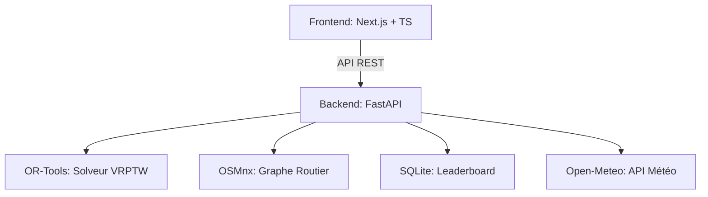

# 🎅 Santa Router Optimizer (Pro Edition)

[](https://fastapi.tiangolo.com/)
[](https://nextjs.org/)
[](https://developers.google.com/optimization)
[](https://leafletjs.com/)

Une plateforme de simulation et d'optimisation de logistique urbaine pour le Père Noël. Ce projet résout des problèmes complexes de tournées de véhicules avec fenêtres de temps (**VRPTW**) en utilisant des données géographiques réelles.

## 🚀 Fonctionnalités Clés

- **Moteur VRPTW** : Optimisation multi-traîneaux sous contraintes de capacité, de temps et d'incidents routiers via Google OR-Tools.
- **Profils IA** : Choisissez entre un mode **⚡ Express** (gain de temps) ou **🌱 Écolo** (réduction de la distance et du CO2).
- **Auto-Suggestion** : Un algorithme d'aide à la décision suggère en temps réel les meilleurs prochains points de livraison au joueur.
- **Météo Réelle** : Connexion à l'API **Open-Meteo** pour appliquer les conditions climatiques réelles de la ville choisie (impact sur la vitesse).
- **Replay Animé** : Visualisez la course entre le Père Noël (Humain) et le Robot (IA) avec une animation fluide sur la carte.
- **Panthéon** : Système de classement persistant (SQLite) pour enregistrer les meilleurs scores mondiaux.

## 🏗️ Architecture



## 🛠️ Installation Rapide

Le projet est livré avec un **Makefile** pour simplifier le développement.

### Prérequis
- Python 3.10+ & Node.js 20+
- Un environnement virtuel `.venv` configuré.

### Commandes
```bash
# 1. Installer tout le projet
make install

# 2. Lancer Backend + Frontend en parallèle
make dev

# 3. Lancer les tests
make test

# 4. Verifier la reproductibilite du solveur
make repro-check
```

Le rapport est exporte dans `daily_reports/repro_solver_pipeline_summary.json` avec:
- hash SHA256 des artefacts open data (graphe, matrices, meteo, incidents),
- hash SHA256 des solutions OR-Tools sur 2 passes identiques,
- taux de reproductibilite global.

*Vous pouvez également utiliser **Docker Compose** pour un déploiement en une ligne : `make docker`.*

## 🧠 Algorithmes Utilisés

1. **Recherche Opérationnelle** : Utilisation de `PATH_CHEAPEST_ARC` et `GUIDED_LOCAL_SEARCH` pour sortir des optima locaux.
2. **Théorie des Graphes** : Algorithme de Dijkstra pour le calcul des matrices de coût à partir des données OpenStreetMap.
3. **Heuristique Temps-Réel** : Algorithme glouton (Greedy) pondéré par les fenêtres de temps pour les suggestions au joueur.

---
*Développé avec ❤️ pour aider le Père Noël à livrer ses colis à l'heure.*
